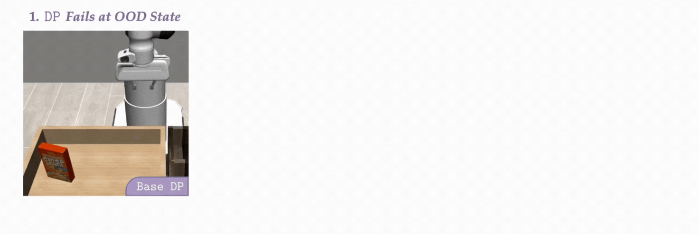
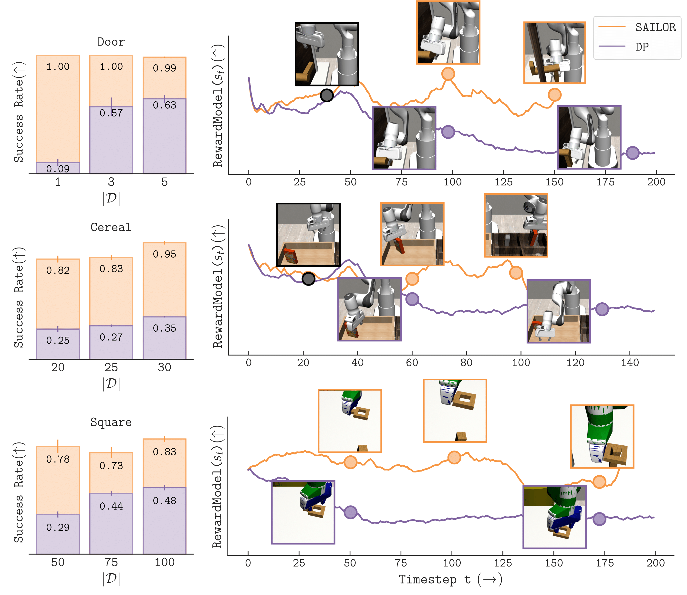

# :sailboat: SAILOR: Searching Across Imagined Latents Online for Recovery 

Official implementation of SAILOR (**NeurIPS 2025 Spotlight**) introduced in

## [A Smooth Sea Never Made a Skilled SAILOR: Robust Imitation via Learning to Search]() 

by [Arnav Kumar Jain*](https://arnavkj1995.github.io/), [Vibhakar Mohta*](https://sites.google.com/view/vibhakarmohta/), [Subin Kim](https://ksb21st.github.io/), [Atiksh Bhardwaj](https://atikshb.github.io/), [Juntao Ren](https://jren03.github.io/), [Yunhai Feng](http://yunhaifeng.com), [Sanjiban Choudhury](https://sanjibanc.github.io/), and [Gokul Swamy](https://gokul.dev/)

[](https://arxiv.org/abs/2506.05294)
[](https://huggingface.co/datasets/arnavkj1995/SAILOR)
[](LICENSE)
[](https://gokul.dev/sailor/)
[](https://x.com/g_k_swamy/status/1932477863162155220)

We introduce SAILOR-- a model-based inverse RL approach for *learning to search* from expert demonstrations. With learned world and reward models on a mixture of expert and on-policy data, the agent in endowed with the ability to, at test time, reason about how to recover from mistakes that the base policy makes.

<p align="center">
  
</p>

Across various visual manipulation problems at different expert dataset scales, SAILOR outperforms Diffusion Policy trained on the same demonstrations. 
Moreover, our learned reward model is able to detect shared prefixes, base policy failure suffixes and SAILOR successful suffixes.
<p align="center">
  
</p>

## Setup :hammer_and_wrench:
Create a ```conda``` environment and install dependencies.
```bash
SUITE="robomimic" # [robomimic | maniskill | robocasa]
conda env create -f env_ymls/${SUITE}_env.yml

# Robocasa only, install the repository by a git clone.
git clone https://github.com/robocasa/robocasa
cd robocasa && git checkout 9f14a76cde2b87c473cbbc5a87eb975b80c2cab6 && pip install -e . && cd ..
```

## Expert demonstrations :floppy_disk:
Follow instructions in [datasets/README.md](https://github.com/arnavkj1995/SAILOR/blob/main/datasets/README.md) to download and extract the datasets for the given environments and suites. For RoboMimic tasks, we use the datasets provided in the benchamark, whereas demonstrations are collected for ManiSkill and RoboSuite tasks via a human teleoperator using a 3D space mouse. Once downloaded and extracted, run the following command to store videos of data loaded in the expert buffer to inspect if the expert dataset is loaded correctly.

```bash
SUITE="robomimic" # [robomimic | maniskill | robocasa]
TASK="can" # Any of the tasks in the paper for the respective suite
NUM_EXP_TRAJS=10 # Number of trajectories to visualize
conda activate ${SUITE}_env
python3 train_sailor.py --wandb_exp_name "test_mppi" \
    --viz_expert_buffer True \
    --configs cfg_dp_mppi ${SUITE} debug\
    --task "${SUITE}__${TASK}" \
    --num_exp_trajs ${NUM_EXP_TRAJS}
```

This should store videos of the expert demonstrations loaded in the expert buffer to `demos/(suite)__(task)/` directory. Videos will be stored in the same resolution and control frequency as loaded in the expert buffer.

### Verifying the setup :nut_and_bolt:
Use the following command to test the training pipeline. If it executes without errors, you are all set to begin training!

```bash
# Only for ManiSkill
export VK_ICD_FILENAMES=/usr/share/vulkan/icd.d/nvidia_icd.x86_64.json # Please change this to your vulkan path

SUITE="robomimic" # [robomimic | maniskill | robocasa]
TASK="can" # Any of the tasks in the paper for the respective suite
conda activate ${SUITE}_env
python3 train_sailor.py --wandb_exp_name "test" \
    --configs cfg_dp_mppi ${SUITE} debug \
    --task "${SUITE}__${TASK}" \
    --num_exp_trajs 10
```

## Training a Seaworthy SAILOR :ocean: :sailboat: 
The SAILOR agent is trained in 3 steps:
1. **Phase 1**:  Pre-train a Diffusion Policy (DP) with the expert demonstrations. 
2. **Phase 2**: Collect multiple trajectories with pre-trained DP to warmstart the world model and reward model.
3. **Phase 3**: Update the agent with multiple rounds where each round involves collecting on-policy trajectories with the planner, updating models, and (optional) finetune the DP by distillation.

To train a SAILOR agent on ```Square``` task in ```RoboMimic``` suite, run the following command with number of expert demostrations (```NUM_EXP_TRAJS```) and seed (```SEED```). The models are trained on a single NVIDIA 6000 Ada GPU with 48 GB memory.
```bash
# Only for ManiSkill
export VK_ICD_FILENAMES=/usr/share/vulkan/icd.d/nvidia_icd.x86_64.json # Please change this to your vulkan path

SUITE="robomimic" # [robomimic | maniskill | robocasa]
TASK="square" # Any task of the respective suite
NUM_EXP_TRAJS=50
SEED=0
conda activate ${SUITE}_env
python3 train_sailor.py \
    --configs cfg_dp_mppi ${SUITE}\
    --wandb_project SAILOR_${SUITE} \
    --wandb_exp_name "seed${SEED}" \
    --task "${SUITE}__${TASK}" \
    --num_exp_trajs ${NUM_EXP_TRAJS} \
    --seed ${SEED}
```

## Running on new tasks :robot:

### Setup Githooks [Optional]
This will trigger automatic black formatting and isort during commit on files you edit. Please ensure you have `black` and `isort` installed (`pip install black isort`).
```bash
git config core.hooksPath .githooks
chmod +x .githooks/pre-commit
```

### Adding your own environment
SAILOR is designed to be pretty modular and easy to setup with your own environment. Here are the steps we recommend following:
1. **Create a new environment**: Create a new conda environment with the necessary dependencies of SAILOR and your environment. Feel free to adapt the `env_ymls/robomimic_env.yml` file to your needs.
2. **Create your environment wrapper**: SAILOR expects the environment to be dreamer style, and return the following information in the step function:
   - `obs`: The observation from the environment, should contain the keys `["agentview_image", "robot0_eye_in_hand_image", "state", "is_first", "is_last", "is_terminal"]`.
   - `reward`: The reward from the environment. This is just used for logging to see if the agent is learning, SAILOR does not use this.
   - `done`: Whether the episode is done.
   - `info`: Should contain the key "success" which is a boolean indicating if the episode was successful.
3. **Write a function to load the expert dataset**: SAILOR expects the expert dataset to be in a `collections.OrderedDict()`. Feel free to reuse code in `get_train_val_datasets` functions of all three suites in the paper.
4. **Add an entry in the `configs.yaml` file**: Add environment specific configurations in the `configs.yaml` file. You can use the existing entries for the suites in the paper as a reference.
5. **Add the suite to train_sailor.py**: Follow the existing structure in train_sailer.py for say "robomimic" and add functions of loading your suite environments and expert datasets at the correct places in the file.

You should be all set to run SAILOR with your own environment now! If you face any issues, feel free to open an issue on the GitHub repository.

### Citation :raised_hands:
If you build on our work or find it useful, please cite it using the following bibtex.

```bibtex
@inproceedings{
  jain2025a,
  title={A Smooth Sea Never Made a Skilled {SAILOR}: Robust Imitation via Learning to Search},
  author={Arnav Kumar Jain and Vibhakar Mohta and Subin Kim and Atiksh Bhardwaj and Juntao Ren and Yunhai Feng and Sanjiban Choudhury and Gokul Swamy},
  booktitle={The Thirty-ninth Annual Conference on Neural Information Processing Systems},
  year={2025},
  url={https://openreview.net/forum?id=qN5hmLkBtC}
}
```

### Acknowledgements :pencil:
This codebase is inspired from the following repositories:
1. Sudeep Dasari's implementation of Diffusion Policy in [DiT-policy](https://github.com/sudeepdasari/dit-policy) 
2. Danijar's implementation of [DreamerV3](https://github.com/danijar/dreamerv3)
3. Naoki Morihira's [DreamerV3](https://github.com/NM512/dreamerv3-torch) in PyTorch.
