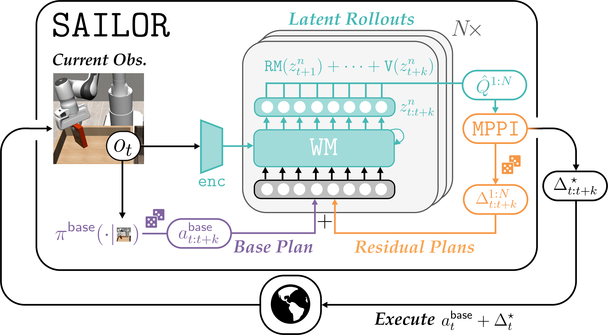

# SAILOR
This directory includes the implementation of the components of SAILOR-- Diffusion Policy, World Model, Reward Model, Critic Network and the MPPI Planner. This directory is structured as follows:

```
sailor
├── classes
│   ├── evaluator.py
│   ├── preprocess.py               # Used for preprocessing data for DP and WM 
│   ├── resnet_encoder.py           # Implementation for the encoder for DP
│   ├── rollout_utils.py            # Replay buffer and sampler for hybrid training 
├── diffusion                       
│   ├── data4robotics               # Code for diffusion process adapted from [data4robotics](https://github.com/data4robotics/data4robotics).
│   └── README.md
├── dreamer
│   ├── dreamer_class.py            # Defines the components of SAILOR
│   ├── imag_behavior.py            # MPPI planner to predict residual actions
│   ├── networks.py                 # Network architectures of components    
│   ├── tools.py                    # Utility functions for distributions, logging and training
│   └── wm.py                       # World Model, Reward Model and Critic
├── policies
│   ├── diffusion_base_policy.py
│   └── residual_policy.py
├── configs.yaml                    # Config with all the parameters
├── README.md
├── sailor_trainer.py
└── trainer_utils.py
```

## Overview
In SAILOR, we *learn a search algorithm* that generates residual plans to correct a nominal plan generated by a base policy. 
With a learned world model (WM), reward model (RM), and critic (V) from the combination of demonstrations and on-policy rollouts, a repeated stochastic rollouts of potential residual plans is performed which are scored within the WM to select the action plan with the highest estimated return. 
The first step of the corrected plan is executed in the environment before re-planning in the style of *model predictive control* (MPC). 
We then execute the first of these actions and then re-plans on top of the new observation. We now describe each of these components.

### Base Policy
SAILOR uses a [Diffusion Policy]() (DP) as the base policy in this work. 
The base policy takes the stack of current and previous observation as input and predicts a $k$-step action plan.
DP uses a pre-trained ResNet-18 encoder with a Spatial Softmax layer for RGB inputs and MLP layers for the proprioceptive states. 
DP is trained with a behavior cloning objective-- formulated as a denoising task where the model learns to predict the noise added to a k-step action chunk, conditioned on the given observation and diffusion timestep. 
During inference, DP uses the DDIM sampling to generate base action plans. 

### World Model
The world model is based on the [DreamerV3](https://arxiv.org/abs/2301.04104) architecture. Since ground truth rewards are not available to the agent, the world model is trained to predict the representation of future states by training with the reconstruction loss. Moreover, the dynamics models can generate rollouts in the latent space which leads to efficient planning at inference time. 
Moreover, we train the world model by hybrid learning approach where the half of the batch of sequences is obtained from the demonstration and other half comes from the replay buffer.

### Reward Model and Critic
The reward model is trained with [Moment Matching](https://arxiv.org/abs/2103.03236) objective to maximize the divergence between the expert demonstrations and the rollouts of the agent. 
SAILOR also has a critic network that is trained to predict the discounted sum of future rewards beyong the planning horizon. 
Both the reward model and critic are trained on the latent representation and are used to rank action sequences while planning in the latent space.

### MPPI Planner
For a given observation and base actions generated by the base policy, SAILOR uses [MPPI Planner](https://arxiv.org/abs/1509.01149) to estimate the residual actions. For planning, the world model is used to generate the latent states in imagination which is feeded through the reward model and critic to select the most promising action sequence and exeutes the action in the environment. This planner is used to collect on-policy rollouts and relabel data to update the base policy via distillation.


<p align="center">
  
</p>

***
[[Top](#sailor)]